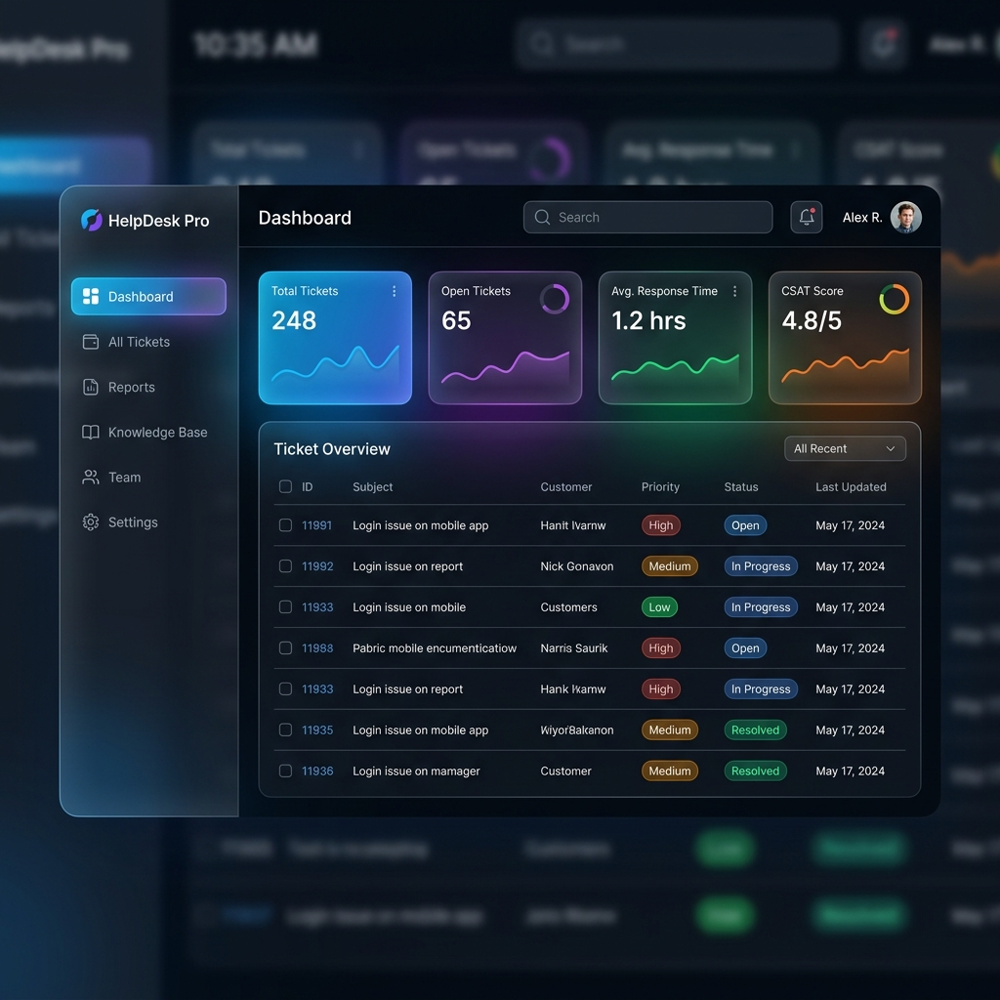

<div align="center">
  
  
  <br />
  <br />

  # 🛠️ PambantuLog

  **Modern Internal Helpdesk & Ticketing System**

  [](https://nextjs.org/)
  [](https://react.dev/)
  [](https://www.typescriptlang.org/)
  [](https://tailwindcss.com/)
  [](https://supabase.com/)
  [](https://orm.drizzle.team/)
  [](https://opensource.org/licenses/MIT)

  [**Live Demo**](https://pambantulog.vercel.app) • [**Architecture Docs**](./docs/architecture.md) • [**Report Bug**](https://github.com/twiners212/PambantuLog/issues)
</div>

<br />

**PambantuLog** is a centralized Internal Helpdesk System designed to record, track, and resolve technical support requests from employees. Built with modern web technologies, it transforms chaotic manual reporting into a systematic, measurable, and transparent workflow.

---

## ✨ Feature Highlights

* 🔐 **Strict Role-Based Access Control (RBAC)**: Secure separation of duties between Admin, Agent (Technician), and Employee (User), protected via client-side guards and database policies.
* 🎫 **State Machine Ticket Lifecycle**: Real-time progression tracking of ticket statuses (*Open → In Progress → Waiting on User → Resolved → Closed*).
* 💬 **Interactive Threaded Comments**: Centralized, real-time communication between the reporter and the support agent within each ticket.
* 🛡️ **Advanced Data Privacy**: Database-level Row Level Security (RLS) ensures employees only see their own tickets, while admins have global visibility.
* 📝 **User Feedback Loop**: CSAT (Customer Satisfaction) rating system for employees to evaluate the service upon ticket resolution.

## 🛠 Tech Stack

**Frontend Architecture:**
- **Framework**: Next.js 16 (App Router)
- **Core Library**: React 19
- **Language**: TypeScript
- **Styling**: Tailwind CSS v4, Lucide React Icons

**Backend & Data Layer:**
- **BaaS**: Supabase (PostgreSQL, Authentication)
- **ORM**: Drizzle ORM
- **API**: Next.js Route Handlers (RESTful)

## 🚀 Installation & Setup

1. **Clone the repository**
   ```bash
   git clone https://github.com/twiners212/PambantuLog.git
   cd PambantuLog
   ```

2. **Install dependencies**
   ```bash
   npm install
   ```

3. **Configure Environment Variables**
   Ask the repository owner for the development environment variables, or connect it to your own Supabase project. Create a `.env.local` file and add:
   ```env
   NEXT_PUBLIC_SUPABASE_URL=your_supabase_url
   NEXT_PUBLIC_SUPABASE_ANON_KEY=your_anon_key
   DATABASE_URL=your_postgres_connection_string
   ```

4. **Run the Development Server**
   ```bash
   npm run dev
   ```
   Open [http://localhost:3000](http://localhost:3000) to view it in your browser.

## 📁 Project Structure

```text
src/
├── app/          # Next.js App Router (Pages & API Routes)
├── components/   # Reusable UI Components & Layouts
├── db/           # Drizzle schema definitions & DB Connection
├── hooks/        # Custom React Hooks (e.g., useRoleGuard)
├── lib/          # Utilities (Supabase client instantiations)
├── styles/       # Global CSS & Tailwind configuration
└── types/        # TypeScript Interfaces and Type Definitions
```

## 📄 License

This project is licensed under the MIT License - see the [LICENSE](LICENSE) file for details.
